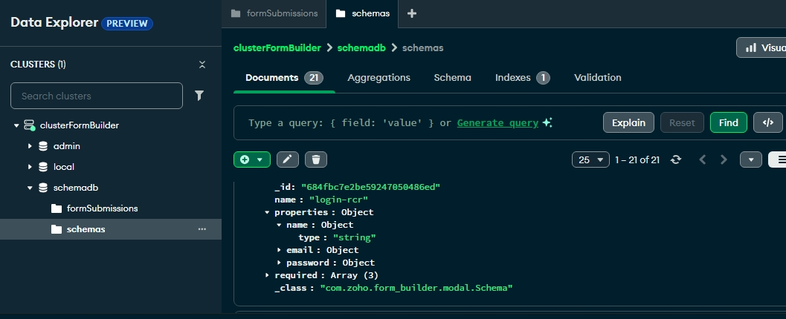

## Schema-Driven Form Builder with Live Validation 

### Deployed Full Stack Application:
[Working Website Link: ] (https://schema-form-builder.netlify.app/)


- Spring Boot backend server is deployed in internet which is accessed by the frontend internally.

### Demo Vedio for reference:
[Demo vedio link](https://drive.google.com/file/d/1lMTz4lAHqujzH-q-rUo5Qhi-poMTjzzg/view?usp=sharing)

--- 

## Steps to run the website in local system:
### For Frontend:

## Prerequisites:
Make sure you have the following installed:

- [Node.js](https://nodejs.org/) (v16 or later recommended)
- npm (comes with Node.js) 


### Steps:
## 📥 Clone the Repository

```bash
git clone https://github.com/CharlesRajaR/dynamic-form-builder-ui
cd dynamic-form-builder-ui
npm install
npm run dev 
```
- then open the browser and go to http://localhost:3000
- You can start editing the page by modifying `app/page.tsx`, `app/api.js` The page auto-updates as you edit the file.

---

### For Backend:
## Running the Backend Locally

## Prerequisites:
Make sure you have the following installed:

- Java 17 or later
- Download: https://jdk.java.net/17


### Method 1: Clone and Build from Github Repository:
1. Clone the repository: `git clone https://github.com/CharlesRajaR/dynamic-form-builder.git`
2. Navigate to the project directory: `cd dynamic-form-builder`
3. Build and run the application: `mvn spring-boot:run`
4. Access the application at `http://localhost:8080`

or 

1. Build your own jar file using command : mvn clean package
2. go to target folder there an executable jar file is created with name form-builder-0.0.1-SNAPSHOT.jar
3. open the command prompt in this folder and type: java -jar form-builder-0.0.1-SNAPSHOT.jar then hit enter.

### Method 2: Run Using Pre-built Executable JAR
1. Clone the repository containing the pre-built executable JAR: `git clone https://github.com/CharlesRajaR/Executable-file-for-form-builder.git`
2. Navigate to the JAR directory: `cd Executable-file-for-form-builder`
3. Run the application using the JAR file: `java -jar form-builder-0.0.1-SNAPSHOT.jar`
4. Access the application at `http://localhost:8080`

### Note:
- while running the backend make sure you turn on the internet because the backend is connecting to the remote mongodb database deployment.

 
---

- After running both the frontend and backend in the local system the request from the frontend(http://localhost:3000) is automatically handled by the backend deployed in the internet, not the backend running locally. so you go to folder "src/app" inside there is a file called api.js open it and change the BASE_URL to "http://localhost:8080" because the backend is running locally in the port (http://localhost:8080).
- Now the website is fully functional and description of functionality is given below.

### Demo  Vedio:
[Demo vedio for using the website](https://drive.google.com/file/d/1_57vEg1vxyu90PWpkeGIoklso7T9SZEz/view?usp=sharing)

---

### Functionalites:

## 1.Import .json schema file
### Description:
- import the .json schema file by clicking the (choose file no file choosen) tab in the top of the website, the name field in the schema is unique for each schema. because based on this name if the schema is already imported previously at any time , that is stored in the database is taken and the current schema is not stored in the database again, this will maintain no duplication in schema.
- For each properties contraints are : type - which denote the type of the field(number, email, string, password).
- If already the schema with same name is imported alert messeage "already the schema with same name is found" is shown, so that you will use that schema or go with your schema by rename the name field in the schema.
- Note: if the imported schema is not valid, then the alert message is shown.

### Format:
```bash
{
    
    "name": "the name of each schema must be unique",
    "properties": {
        "name": {
          "type": "string"
        },
        "email": {
          "type": "email"
        },
        "age": {
          "type": "number or integer",
          "min":"specify minimum number eg:18",
          "max":"specify maximum number"
        },
        "dob": {
          "type": "date",
          "min":"2003-01-01",
          "max":"2007-01-01"
        },
        "password": {
          "type": "password",
          "minLength": "replace with minimum length of the text",
          "maxLength": "replace with maximum length of the text"
        },
        "state": {
          "type": "string"
        }
       },
    "required": ["name", "email", "required"]
 }
 ```

## 2.Create Dynamic Form
### Description:
- Click the create form button to create the dynamic form
- Note : For validation part I did not use third party libraries like Yup etc., Instead i use javascript to validate the form.

## 3.Submit Form
### Description:
- Submit the form by clicking the submit button, which will submit data if all the data are valid, otherwise it will give an alert message based on the error like required field is missing, text length is not matching respectively.
- After Submitting the backend spring-boot will store the form data with association with the particular schema after validating the form data based on that schema.
- Data are stored in the mongodb database.

## 4.Previous data
### Description:
- Click the show previous data button, which  will get all the previously submitted form for the current schema from the backend and then render in the website.
- Click the hide previous data button to hide the previous data.

## 5.Export Schema:
### Description:
- Click the export button to export the current form schema which will be used for re import.
- the downloaded file format is given below
### Format:
```bash
{
  "id": "685777de3f325542c76a47ae",
  "name": "schema-1",
  "properties": {
    "name": {
      "type": "string"
    },
    "email": {
      "type": "email"
    },
    "age": {
      "type": "integer",
      "min": "18",
      "max": "30"
    },
    "password": {
      "type": "password",
      "minLength": "8",
      "maxLength": "10"
    },
    "state": {
      "type": "string"
    }
  },
  "required": [
    "name",
    "email",
    "password"
  ]
}
 ```


## 6.Export Form Data:
### Description:
- Click the export Form button to export the current form schema with the data of all submitted forms.
- The downloaded file format is given below
### Format:
```bash
{
  "schema": {
    "id": "685777de3f325542c76a47ae",
    "name": "schema-1",
    "properties": {
      "name": {
        "type": "string"
      },
      "email": {
        "type": "email"
      },
      "age": {
        "type": "integer",
        "min": "18",
        "max": "30"
      },
      "password": {
        "type": "password",
        "minLength": "8",
        "maxLength": "10"
      },
      "state": {
        "type": "string"
      }
    },
    "required": [
      "name",
      "email",
      "password"
    ]
  },
  "formData": [
    {
      "Form-1": {
        "name": "Charles Raja",
        "email": "rcharlesraja2003@gmail.com",
        "age": "18",
        "password": "Add23@ja",
        "state": "Tamil Nadu"
      }
    },
    //All submitted forms appear here...
  ]
}
 ```

## 7.Remove Imported Schema:
### Description:
- Click the remove import schema button which will clear all data of the current schema

### Website UI:


---

## 🧱 Tech Stack Used:
### 🖥️ Frontend: Next.js
- Why Next.js?

- Seamlessly integrates with React, allowing dynamic rendering of form fields based on the input JSON Schema.
- Its file-based routing and modular structure made organizing UI components intuitive and efficient.

### How it helped solve the problem:

Dynamic form rendering was handled with ease by React components, and Next.js provided a structured way to manage routes, handle client-server interaction, and support live form validation in real-time.

### 🧠 Backend: Java (Spring Boot)
- Why Java and Spring Boot?

- Spring Boot offers robust data validation, dependency injection, and easy integration with databases, making it ideal for scalable API development.
- Mature ecosystem and strong community support helped quickly implement JSON Schema validation on the server-side.
- Secure and production-ready out of the box — essential for handling and validating form submissions safely.

### How it helped solve the problem:
Server-side validation reused the same JSON Schema as the frontend, ensuring consistency.Spring Boot simplified the creation of RESTful APIs for schema storage, data submission, export, and retrieval.

## 🗃️ Database: MongoDB
- Why MongoDB?

- Schema-less design was ideal for storing dynamic form data that may vary in structure depending on the schema.
- Great support for nested and complex JSON-like documents (BSON), aligning naturally with JSON Schema-based data.
- Scalability and flexibility were a plus for future extensions (e.g., storing user submissions per schema, querying exports, etc.).

### How it helped solve the problem:
Easily associated multiple submitted form datasets with a specific schema.

### Mongodb schema document:

### Mongodb Form document:

